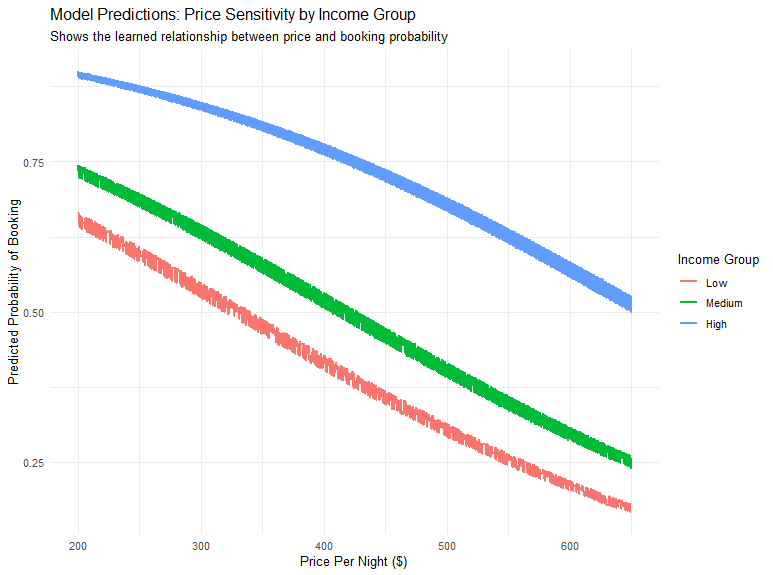

# Analysis of Hotel Booking Price Sensitivity

## Overview

This project analyzes a simulated dataset to model the relationship between hotel price changes and a customer's likelihood to book. The primary goal is to estimate price elasticity and understand how it varies across different customer segments, providing insights for a hypothetical dynamic pricing strategy.

---

## Business Problem

An online travel agency needed a more reliable estimate of consumer price sensitivity than their previous findings, which were based on observational data. Observational data can be misleading, as price is often correlated with other factors (like quality or demand) that also influence booking. This project uses data from a simulated **randomized experiment**—the gold standard for causal inference—to isolate the true effect of price on consumer behavior.

---

## Data

The analysis uses a **synthetic dataset** of 25,000 customer interactions, which was generated to mimic the structure of the original academic case study. The data is publicly available in this repository. Key variables include:

* **PricePerNight:** The randomly assigned price shown to the customer.
* **UserIncome:** An estimate of the customer's income level.
* **Region:** The destination market.
* **Booked?:** A binary outcome (1 if booked, 0 if not).
* **Nights:** The number of nights booked (0 for non-bookings).

---

## Key Findings & Visualizations

The analysis yielded several key insights into customer behavior.

### 1. Price is the Strongest Driver of Booking Decisions
As the price per night increases, the probability that a customer will book decreases significantly. This core relationship is visualized below, showing a clear downward trend across all customer income segments.

### 2. High-Income Customers Are Less Deterred by Price
While all customers are sensitive to price, higher-income customers have a significantly higher baseline probability of booking at any given price point.

### 3. Price Does Not Affect Length of Stay
Interestingly, for customers who *do* decide to book, the price of the hotel does not have a statistically significant effect on the number of nights they choose to stay. This suggests that the primary challenge for the business is securing the initial booking, not upselling the duration.

---

## Methodology

The analysis was conducted in R and followed these steps:
1.  **Data Preparation:** Cleaned and prepared the data, creating categorical income groups for segmented analysis.
2.  **Exploratory Data Analysis (EDA):** Generated summary statistics and visualizations to identify initial trends.
3.  **Modeling:**
    * A **Logistic Regression Model** was built to predict the binary outcome of whether a customer booked.
    * A **Linear Regression Model** was built to analyze the factors influencing the number of nights for successful bookings.
4.  **Interpretation:** The model coefficients and predictions were analyzed to derive the business insights listed above.

---

## Skills Demonstrated

* **Languages:** R
* **Libraries:** `dplyr`, `ggplot2`, `broom`
* **Techniques:** Data Cleaning, Exploratory Data Analysis (EDA), Logistic Regression, Linear Regression, Model Interpretation, Causal Inference, Data Visualization.
